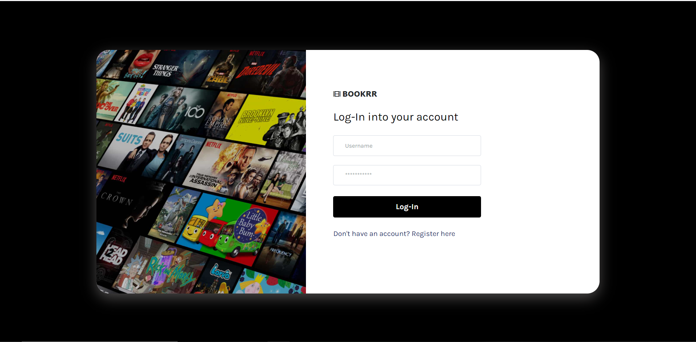
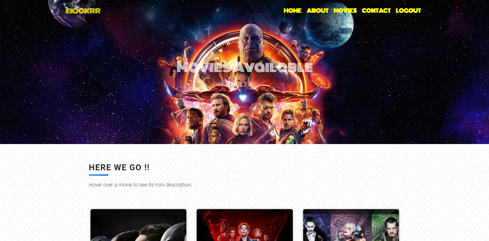
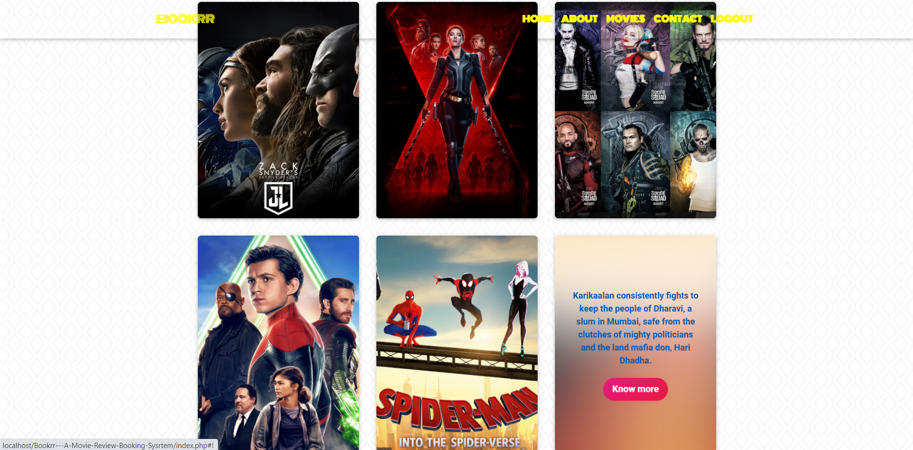
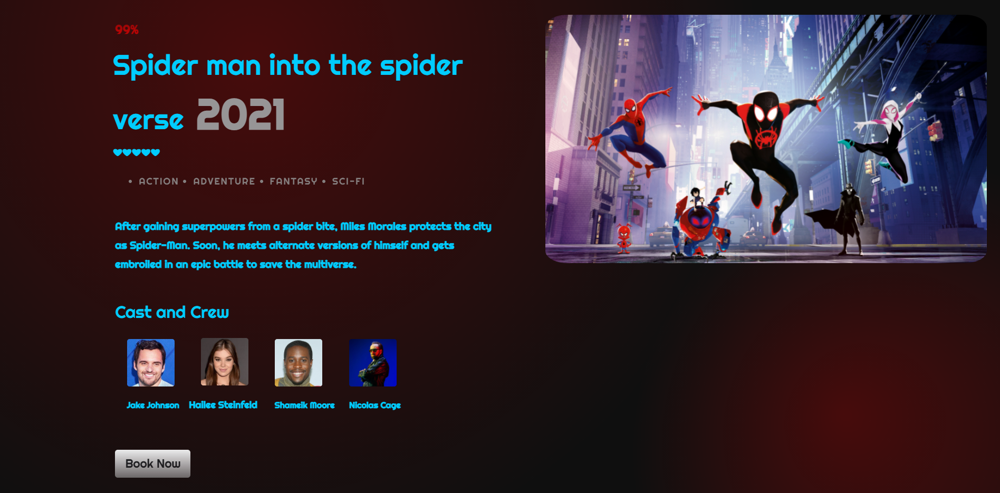
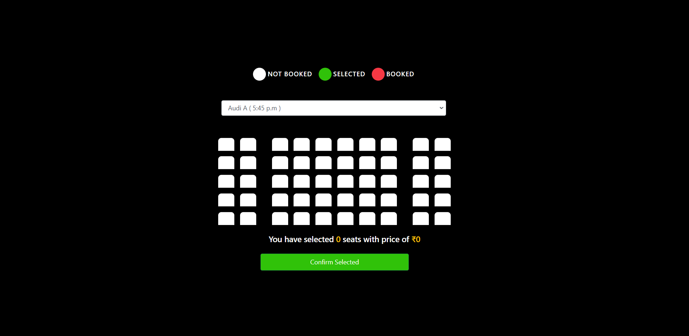

# Title 

Bookrr
( Review/Booking Application )

## Purpose

Everyone in today's world loves movies, be it Hollywood, Bollywood, Tollywood etc. We aim to connect the world of cinemas and the public by giving them a platform to get         information about the movies and also book tickets of the movie of their choice. This Web application will almost close the gap between the common public and the beautiful       world of movies.
  
## Pros 

  1. Brief as well as detailed description of the movies available in your nearby theatres.  
  2. Select Your preferred Movie.  
  3. Check Availability of Tickets.
  4. Don’t Have to Stand in Long Queues.
  5. Reach Theatre on Time.
  6. Don’t have to Reach Early and stand in Ticket Counter.
  7. Easy Payment through Credit cards , Debit cards , Net banking , UPI's etc.. 

## Technologies 

  1. Html , Css , Javascript
  2. Bootstrap
  3. Php , MySql
  4. Razorpay 

## WHAT'S INSIDE 

## Login Page

## Home Page

## Description Page

## Seating Arrangement 
 

## Credits 

  A. CodePen
  B. Javascript-Mastery
  C. Ashish Kashyap
  
  

